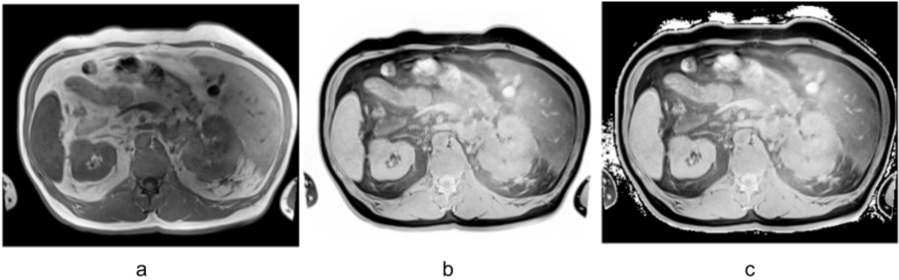

# Annotation-Acceleration
> Image inversion step to transfrom MR images to synthetical CT

MRI segmentation tools are significantly less common compared to those available for CT imaging. However, many CT-based tools can also be applied to MR images, often yielding results that, while not perfect, serve as a reliable foundation for creating annotations. These annotations can then be used to train MRI-specific models with minimal adjustments.

One effective technique to improve compatibility is inverting MR images before further processing. This inversion creates a pseudo-synthetic CT representation, making the images more interpretable by CT-based models.

Here we provide example code for image inversion and demonstrates how to integrate it effectively with TotalSegmentor. Further details and findings will be shared in an upcoming publication.


(a : raw T1w-MRI | b : inverted T1w-MRI | c : inverted T1w-MRI with black background)


## Sample Code
```python
def invert(img, keep_background=True):
    img = img.clip(0, 3000)
    _max = img.max()
    _min = img.min()
    img = _max - img + _min

    if keep_background:
        th = (_max - _min) * 0.99 + _min
        img[img >= th] = 0

    return img
```

## Inference
```bash
pip install TotalSegmentator
pip install monai

python main.py <path_to_image> # invert image
TotalSegmentator -i <inverted_image> -o segmentations --ml --fast # fast option yields best results for MRI
```